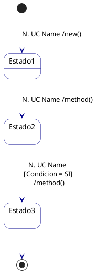

# PlantUML State Machine Modeling Guidelines

## Overview
This skill defines the rules for creating and modifying PlantUML **state machine diagrams** (`@startuml` … `@enduml`) inside `entrega-n/` folders. It ensures states come exclusively from the domain description, transitions reference proper methods and use cases, and the class diagram (`1.vista-analisis.puml`) stays consistent.

## Dependencies
- **puml-modeling** — General PlantUML modeling guidelines (immutable domain model, naming conventions, consistency rules).

## Reference Files (always read before modifying a state machine)

| File | Role |
|---|---|
| `docs/descripcion_dominio.md` | **Sole source** for identifying states. |
| `docs/modelo_dominio_bolsines.puml` | Base domain model — the starting point of the system. **Never modify this file.** |
| `docs/listado_funcionalidad_sistema.md` | Use case catalog (number + name). |
| `entrega-n/1.vista-analisis.puml` | Delivery class diagram — where new methods are declared. |

> [!IMPORTANT]
> `docs/modelo_dominio_bolsines.puml` is the immutable starting point of the system. The `entrega-n/1.vista-analisis.puml` file extends it with additional methods needed for each delivery. This convention applies across all skills in this project.

---

## Rules

### 1. States — Source and Declaration

- **States MUST be identified exclusively from `docs/descripcion_dominio.md`.**
  Read the domain description to extract every state mentioned for the entity being modeled (e.g., *Registrada*, *En remito*, *En bolsín saliente*, etc.).

> [!IMPORTANT]
> `docs/descripcion_dominio.md` is the **sole source** for all modeling decisions: which states exist, which transitions are valid, and what conditions guard them. `docs/listado_funcionalidad_sistema.md` is consulted **only** to look up the UC number and name to display in the transition label — it must never be used to infer or justify a new state or transition.
- **States are declared only — no descriptions are allowed.**
  Use the PlantUML `state` keyword with no body:
  ```plantuml
  state Registrada
  state EnRemito
  state EnBolsinSaliente
  ```
- **State names MUST be CamelCase** (PascalCase), with no spaces or underscores (e.g., `EnBolsinSaliente`, not `En Bolsin Saliente`).

### 2. Pseudostates

Every state machine diagram **must** include:
- An **initial pseudostate** (`[*] -->`) to mark the entry point.
- A **final pseudostate** (`--> [*]`) to mark terminal states.

**Pseudostate transitions must NOT have methods or use cases associated.**
```plantuml
[*] --> Registrada
RecibidaYAceptada --> [*]
DeBaja --> [*]
```

### 3. Transition Methods

- Every non-pseudostate transition **must** reference a method that describes the action being performed.
- Methods must be **descriptive of the transition/action** they represent. Examples of good method names:
  - `remitar()`, `cancelar()`, `asociarBolsin()`, `enviar()`, `aceptar()`, `rechazar()`, `redirigir()`
- **Using `setEstado()` as a transition method is NOT allowed** — it is not descriptive enough. Instead, create a method that describes the specific transition semantically.

### 4. Method Sourcing and Consistency

When identifying the method for a transition, follow this order:

1. **Check `docs/modelo_dominio_bolsines.puml` first.** If the domain model already defines a suitable method on the entity class, use it. If used, the method **must also be present** in `entrega-n/1.vista-analisis.puml` for the same class.
2. **If no suitable method exists in the domain model**, create a new descriptive method and **add it only to `entrega-n/1.vista-analisis.puml`**. Never modify `docs/modelo_dominio_bolsines.puml`.

> [!WARNING]
> If a method from the domain model is used in the state machine, verify it is declared in the delivery's `1.vista-analisis.puml`. If missing, add it there. The consistency checker will flag this as an error otherwise.

### 5. Transition Label Format

Every non-pseudostate transition label must follow this format:

```
N. UC Name /method()
```

Where:
- `N` is the use case number from `docs/listado_funcionalidad_sistema.md`
- `UC Name` is the use case name from the same file
- `method()` is the method invoked on the entity to perform the transition

**Example:**
```plantuml
Registrada --> EnRemito : 15. Generar Remito /remitar()
```

### 6. Conditional Transitions

A single method may transition to **more than one state** using guard conditions. Conditions must be written in **natural language Spanish** inside square brackets:

```plantuml
EnBolsinEnviado --> RecibidaYAceptada : 28. Registrar recepción de bolsín \n [Contenido coincide con lo registrado = SI] \n /aceptar()
EnBolsinEnviado --> NoRecibida : 28. Registrar recepción de bolsín \n [No se recibe toda la documentación asociada = SI] \n /noRecibir()
```

**Format for conditional labels:**
```
N. UC Name \n [Condición en lenguaje natural = SI] \n /method()
```

Use `\n` for line breaks to keep the diagram readable.

The initial pseudostate transition **must** carry the UC label and method that creates the entity, because creating the entity is what places it into its first state:

```plantuml
' ✅ Correct — creation is an action backed by a UC
[*] --> Registrada : 7. Registrar Documentación /new()
DeBaja --> [*]

' ❌ Incorrect — bare initial arrow loses traceability
[*] --> Registrada
```

Final pseudostate transitions (`--> [*]`) remain bare — terminal states have no exit action.

---

## Diagram Template



---

## Checklist (before finalizing)

- [ ] All states come from `docs/descripcion_dominio.md` only
- [ ] States are declared without descriptions (no body)
- [ ] Initial `[*] -->` transition carries the creation UC label and `/new()` method
- [ ] Final `--> [*]` transitions are bare (no label)
- [ ] Every other transition has format `N. UC Name /method()`
- [ ] Methods are descriptive (`remitar()`, `aceptar()`, not `setEstado()`)
- [ ] Methods from `docs/modelo_dominio_bolsines.puml` are also present in `entrega-n/1.vista-analisis.puml`
- [ ] New methods (not in domain model) are added only to `entrega-n/1.vista-analisis.puml`
- [ ] Conditional transitions use `[Condición = SI]` format
- [ ] State names use CamelCase

## Common Mistakes
- **Using `setEstado()` as a transition method** — always use a descriptive action method instead.
- **Forgetting to sync methods with the vista-analisis** — if you reference `remitar()` from the domain model, it must appear on the entity class in `1.vista-analisis.puml`.
- **Adding state descriptions** — states must be declared bare, with no body content.
- **Adding methods to final pseudostate transitions** — only the initial transition carries a UC label; final transitions (`--> [*]`) are always bare.
- **Using listado_funcionalidad_sistema.md to decide states or transitions** — that file only provides UC numbers and names for labels. All structural decisions (states, transitions, guards) must come from `docs/descripcion_dominio.md`.
- **Inventing states not in the domain description** — every state must be traceable to `docs/descripcion_dominio.md`.
